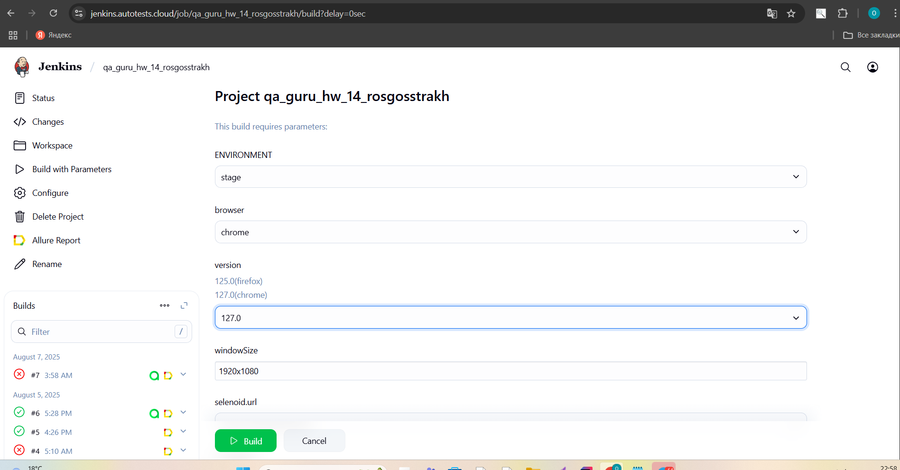
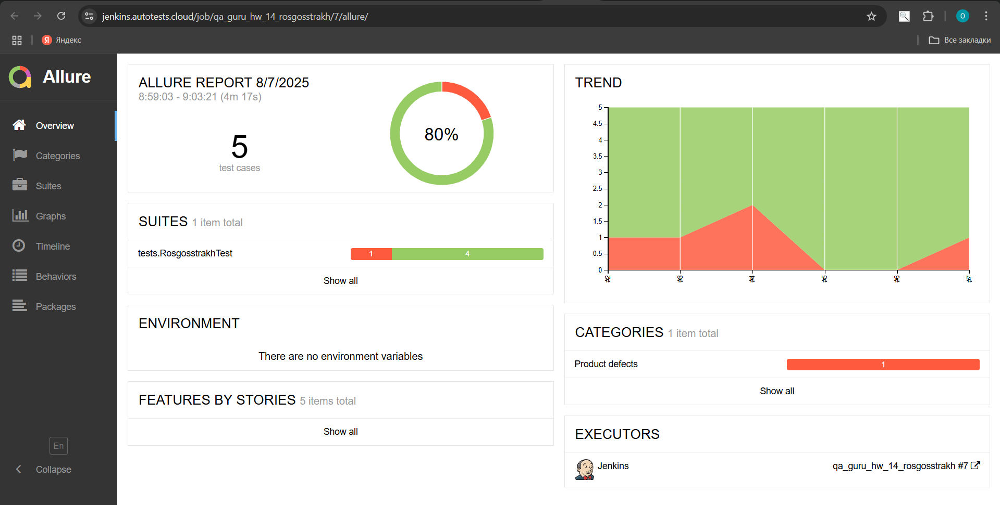
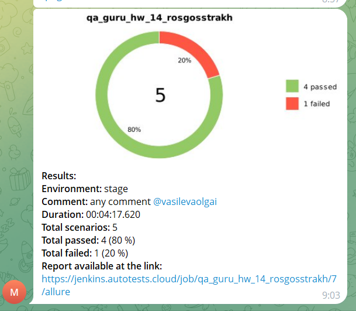
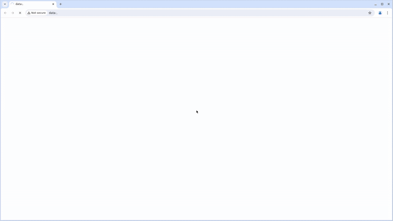

# Проект по автоматизации тестирования для компании [Росгосстрах](https://www.rgs.ru/)

## **Содержание:**
____


* <a href="#tools">Технологии и инструменты</a>
* <a href="#jenkins">Сборка в Jenkins</a>
* <a href="#console">Запуск из терминала</a>
* <a href="#allure">Allure отчет</a>
* <a href="#allure-testops">Интеграция с Allure TestOps</a>
* <a href="#jira">Интеграция с Jira</a>
* <a href="#telegram">Уведомление в Telegram </a>
* <a href="#video">Видео примера запуска тестов в Selenoid</a>
____

<a id="tools"></a>
## **Технологии и инструменты**

<p align="center">


</p>


- Язык программирования для написания автотестов: 
  - <code>Java</code>
- Фреймворки для тестирования:
  - [Selenide](https://selenide.org/) (для автоматизации браузерных тестов)
  - <code>JUnit 5</code> (для структурирования и запуска тестов)
- Сборка и управление зависимостями: <code>Gradle</code>
- Запуск браузеров в [Selenoid](https://aerokube.com/selenoid/) при прогоне тестов
- CI/CD: <code>Jenkins</code> (реализована джоба для удаленного запуска тестов) с формированием Allure-отчета и отправкой результатов в <code>Telegram</code> при помощи бота. 
- Интеграция с <code>Allure TestOps</code> и <code>Jira</code> (управление тест-кейсами и аналитика)

Содержание Allure-отчета:
* Шаги теста;
* Скриншот страницы на последнем шаге;
* Page Source;
* Логи браузерной консоли;
* Видео выполнения автотеста.

____
<a id="jenkins"></a>
##  Сборка в Jenkins

Для запуска сборки необходимо перейти в раздел <code>Собрать с параметрами</code> и нажать кнопку <code>Собрать</code>.
<p align="center">

</p>

____
<a id="console"></a>
 ***Запуск из терминала***
```
gradle clean znak_test
```
При выполнении команды, тесты запустятся удаленно в [Selenoid](https://aerokube.com/selenoid/).

***Удаленный запуск через Jenkins***
```
clean
znak_test
-Dbrowser=${browser}
-Dversion=${version}
-DwindowSize=${windowSize}
-Dselenoid.url=https://user1:1234@${selenoid.url}/wd/hub
```
***Параметры сборки в Jenkins***

- *browser (браузер, в котором выполнятся тесты - по умолчанию chrome)*
- *version (версия браузера - по умолчанию 127)*
- *windowSize (размер окна браузера, в котором будут выполняться тесты)*
- *selenoid.url (адрес удаленного сервера, на котором будут запускаться тесты)
____
<a id="allure"></a>
##  Пример Allure-отчета

<p align="center">

</p>

В отчете Allure представлены результаты тестирования с общей статистикой.
____
<a id="allure-testops"></a>
##  Интеграция с Allure TestOps

Выполнена интеграция сборки <code>Jenkins</code> с <code>Allure TestOps</code>.
На дашборде представлен состав тест-кейсов (автоматизированные и ручные кейсы), запуски, результаты прогонов (успешные/неуспешные тесты)
<p align="center">

</p>

____
<a id="jira"></a>
##  Интеграция с Jira

Реализована интеграция <code>Allure TestOps</code> с <code>Jira</code>,в тикете отображается информация, какие тест-кейсы были написаны в рамках задачи и результат их прогона.

<p align="center">

</p>

____
<a id="telegram"></a>

###  Уведомления в Telegram с использованием бота

После завершения сборки, бот созданный в Telegram, автоматически обрабатывает и отправляет сообщение с результатом.
<p align="center">

</p>

____
<a id="video"></a>

## Видео примера запуска тестов в Selenoid

К каждому тесту в отчете прилагается видео прогона.
<p align="center">
  
</p>